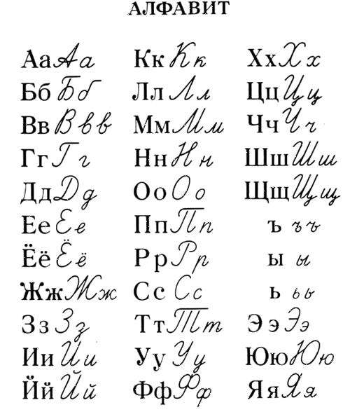
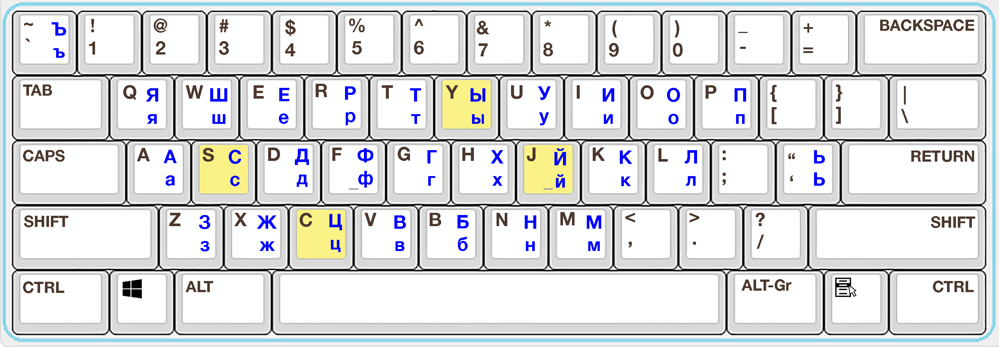
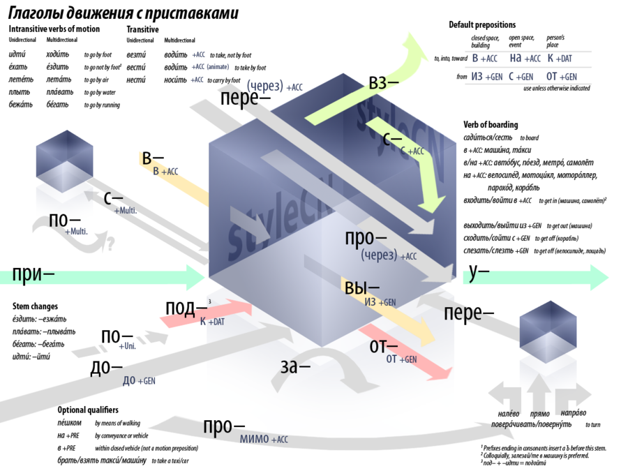

<style type="text/css">
.tg {border-collapse:collapse;border-color:#aaa;border-spacing:0;margin:0px auto;}
.tg td{background-color:#fff;border-color:#aaa;border-style:solid;border-width:1px;color:#333;font-family:Arial, sans-serif;font-size:14px;overflow:hidden;padding:10px 5px;word-break:normal;}
.tg th{background-color:#f38630;border-color:#aaa;border-style:solid;border-width:1px;color:#fff;font-family:Arial, sans-serif;font-size:14px;font-weight:normal;overflow:hidden;padding:10px 5px;word-break:normal;}
.tg .tg-cell{border-color:inherit;font-family:inherit;text-align:center;vertical-align:middle}
.tg .tg-head{border-color:inherit;font-family:inherit;font-weight:bold;text-align:center;vertical-align:top}
.tg .animated{color:#f00;}
</style>
<!-- 多余空格 (?<![\n ]) {2,100}(?![ \|]) -->

# Alphabet - 字母

## Cyrillic - 西里尔字母

| Cyrillic Unicode<br />0400-04FF | 0    | 1    | 2    | 3    | 4    | 5    | 6    | 7    | 8    | 9    | A    | B    | C    | D    | E    | F    |
| ------------------------------- | ---- | ---- | ---- | ---- | ---- | ---- | ---- | ---- | ---- | ---- | ---- | ---- | ---- | ---- | ---- | ---- |
| 040x                            | Ѐ    | Ё    | Ђ    | Ѓ    | Є    | Ѕ    | І    | Ї    | Ј    | Љ    | Њ    | Ћ    | Ќ    | Ѝ    | Ў    | Џ    |
| 041x                            | А    | Б    | В    | Г    | Д    | Е    | Ж    | З    | И    | Й    | К    | Л    | М    | Н    | О    | П    |
| 042x                            | Р    | С    | Т    | У    | Ф    | Х    | Ц    | Ч    | Ш    | Щ    | Ъ    | Ы    | Ь    | Э    | Ю    | Я    |
| 043x                            | а    | б    | в    | г    | д    | е    | ж    | з    | и    | й    | к    | л    | м    | н    | о    | п    |
| 044x                            | р    | с    | т    | у    | ф    | х    | ц    | ч    | ш    | щ    | ъ    | ы    | ь    | э    | ю    | я    |
| 045x                            | ѐ    | ё    | ђ    | ѓ    | є    | ѕ    | і    | ї    | ј    | љ    | њ    | ћ    | ќ    | ѝ    | ў    | џ    |
| 046x                            | Ѡ    | ѡ    | Ѣ    | ѣ    | Ѥ    | ѥ    | Ѧ    | ѧ    | Ѩ    | ѩ    | Ѫ    | ѫ    | Ѭ    | ѭ    | Ѯ    | ѯ    |
| 047x                            | Ѱ    | ѱ    | Ѳ    | ѳ    | Ѵ    | ѵ    | Ѷ    | ѷ    | Ѹ    | ѹ    | Ѻ    | ѻ    | Ѽ    | ѽ    | Ѿ    | ѿ    |
| 048x                            | Ҁ    | ҁ    | ҂    | ◌҃    | ◌҄    | ◌҅    | ◌҆    | ◌҇   | ◌҈    | ◌҉    | Ҋ    | ҋ    | Ҍ    | ҍ    | Ҏ    | ҏ    |
| 049x                            | Ґ    | ґ    | Ғ    | ғ    | Ҕ    | ҕ    | Җ    | җ    | Ҙ    | ҙ    | Қ    | қ    | Ҝ    | ҝ    | Ҟ    | ҟ    |
| 04Ax                            | Ҡ    | ҡ    | Ң    | ң    | Ҥ    | ҥ    | Ҧ    | ҧ    | Ҩ    | ҩ    | Ҫ    | ҫ    | Ҭ    | ҭ    | Ү    | ү    |
| 04Bx                            | Ұ    | ұ    | Ҳ    | ҳ    | Ҵ    | ҵ    | Ҷ    | ҷ    | Ҹ    | ҹ    | Һ    | һ    | Ҽ    | ҽ    | Ҿ    | ҿ    |
| 04Cx                            | Ӏ    | Ӂ    | ӂ    | Ӄ    | ӄ    | Ӆ    | ӆ    | Ӈ    | ӈ    | Ӊ    | ӊ    | Ӌ    | ӌ    | Ӎ    | ӎ    | ӏ    |
| 04Dx                            | Ӑ    | ӑ    | Ӓ    | ӓ    | Ӕ    | ӕ    | Ӗ    | ӗ    | Ә    | ә    | Ӛ    | ӛ    | Ӝ    | ӝ    | Ӟ    | ӟ    |
| 04Ex                            | Ӡ    | ӡ    | Ӣ    | ӣ    | Ӥ    | ӥ    | Ӧ    | ӧ    | Ө    | ө    | Ӫ    | ӫ    | Ӭ    | ӭ    | Ӯ    | ӯ    |
| 04Fx                            | Ӱ    | ӱ    | Ӳ    | ӳ    | Ӵ    | ӵ    | Ӷ    | ӷ    | Ӹ    | ӹ    | Ӻ    | ӻ    | Ӽ    | ӽ    | Ӿ    | ӿ    |

```python
# 俄语字符按字典顺序打印
s=""
v=0
while v<32:
    if v==6:
        s+="Ёё"
    s+='%c%c'%(0x0410+v, 0x0430+v)
    v+=1
print(s)
```

现代的书写中 Ёё 会简写成 Ее

## Handwriting - 手写体



## Italic - 斜体

打印体的斜体
$$
АаБбВвГгДдЕеЁёЖжЗзИиЙйКкЛлМмНнОоПпРрСсТтУуФфХхЦцЧчШшЩщЪъЫыЬьЭэЮюЯя
$$

部分小写的斜体跟手写体相似：

- г $г$
- д $д$
- и $и$
- п $п$
- т $т$

## Keyboard - 键盘

windows注记键盘



- ч: C+H
- щ: S+C
- э: Y+E 或 J+E
- ю: Y+U 或 J+U

# Pronounce - 发音

## Unstressed \ Stressed - 轻音 \ 重音

- о 轻音读 а
- е 轻音读 и
- я 轻音读 и

单音节的介词，轻读且和后面的词连读，如：

- до свидания 的 до 读作 да

一些规则：

- ё 一定是重音
- 若在动词原型中重音不在结尾，则在各种变位中重音位置固定
- 若在动词原型中重音在结尾，则在 я 的变位中重音固定在结尾，另外五种变位的重音可能都在结尾，也可能都在词根

## Unvoiced \ Voiced - 清音 \ 浊音

清浊辅音会变换，多读就有规律了

## Spelling Rules - 基本拼写规则

- Г, К, Х, Ж, Ч, Ш, Щ 后的 Ы 替换成 И
- Ж, Ч, Ш, Щ, Ц 后的 非重读的O 替换成 E （只有большо́й是重读的）
- Г, К, Х, Ж, Ч, Ш, Щ, Ц 后的 Я 替换成 А
- Г, К, Х, Ж, Ч, Ш, Щ, Ц 后的 Ю 替换成 У

## 字母的读音

1.5

## 一些发音特例

- <u>ч</u>то: ш
- пожал<u>уй</u>ста: 不发音
- здравст<u>в</u>уйте: 不发音
- е<u>г</u>о, -о<u>г</u>о: в
- се<u>г</u>одня: в

一些外来词中е不读ye，读э：

- теннис
- компьютер

# Noun - 名词

## Gender - 性

名词有性，先看词义，若有明显的男女之分，则直接判断，否则再看词尾：

| masculine 阳性 | feminine 阴性 | neutral 中性                |
| -------------- | ------------- | --------------------------- |
| -辅音          | -а            | -о                          |
| -й             | -я            | -е                          |
| -ь             | -ь 大部分     | -и \ -у \ -ю 大概率是外来词 |

## Number - 数

复数变形

简单记忆：

| masculine     | feminine      | neutral      |
| ------------- | ------------- | ------------ |
| -ы            | -а 变 -ы      | -о 变 -а     |
| -й \ -ь 变 -и | -я \ -ь 变 -и | -е 变 -я     |
|               |               | -мя 变 -мена |

另外还有很多特例

## Animated - 动静

在Accusative Case中会根据是否是Animated而选择形式

| Animated                                             | Inanimated                             |
| ---------------------------------------------------- | -------------------------------------- |
| 人、人名<br />человек \ лицо 人<br />Иван 伊万<br /> | 一群人<br />народ 人民<br />армия 军队 |
| 动物                                                 | 植物                                   |
| матрёшки 套娃                                        |                                        |

## Case - 格

名词根据在句中的作用而变格，好处是句中词的顺序可以随意了，坏处是~~太尼玛~~麻烦了

动词后接Accusative表具体某物，接Genitive表抽象或少许的东西

### Nominative Case - 主语格

Именительный падеж

用法：

- Есть <u>чай</u>. = There is tea.

### Genitive Case - 所属格

Родительный падеж

of ...

简单记忆：

1. 单数 （feminine和neutral的变形和复数的变法相同）

   | masculine     | feminine      | neutral      |
   | ------------- | ------------- | ------------ |
   | -а            | -а 变 -ы      | -о 变 -а     |
   | -й \ -ь 变 -я | -я \ -ь 变 -и | -е 变 -я     |
   |               |               | -мя 变 -мени |

2. 复数

用法：

1. 所属关系
   - план <u>города</u> = map of the town
   - имя <u>дочери</u> = name of daughter
2. 数量（2, 3, 4, 5结尾的数词用Gen.单数）
   - три <u>рубля</u> = three rouble (three of rouble)
   - <u>рубля</u> три = about three rouble (about three of rouble) 名词在前，数量在后，表示大约
   - много <u>времени</u> = a lot of time
3. нет 表没有 there isn't
   - Нет <u>чая</u>. = There is no tea.
   - Нет <u>времени</u>. = There is no time.
4. negated transitive verbs: Lesson 24

前置介词：

| Preposition  | Meaning                                                      |
| ------------ | ------------------------------------------------------------ |
| без          | without                                                      |
| близ         | near                                                         |
| вблизи       | near                                                         |
| ввиду        | in view of                                                   |
| вдоль        | along                                                        |
| вместо       | instead of                                                   |
| вне          | outside                                                      |
| внутри       | "inside" to indicate the position                            |
| внутрь       | "inside" to indicate movement                                |
| возле        | near                                                         |
| вокруг       | round                                                        |
| впереди      | in front of                                                  |
| вследствие   | because of                                                   |
| для          | for                                                          |
| до           | up to, until, before                                         |
| из           | out of                                                       |
| из-за        | out from behind, because of                                  |
| из-под       | out from under                                               |
| кроме        | besides, except                                              |
| между        | "between" used with the genitive only in a few  phrases: читать между строк, между двух огней |
| мимо         | past                                                         |
| напротив     | opposite                                                     |
| насчет       | about, as regards                                            |
| около        | at the side of, near, around                                 |
| от (ото)     | from, away from                                              |
| относительно | concerning                                                   |
| подле        | alongside of                                                 |
| позади       | behind                                                       |
| помимо       | besides, apart from                                          |
| после        | after                                                        |
| посреди      | in the middle of                                             |
| посредством  | by means of                                                  |
| против       | against                                                      |
| путём        | by means of                                                  |
| ради         | for the sake of                                              |
| с (со)       | from, off, since                                             |
| сверх        | on top of, over and above                                    |
| свыше        | over, more than                                              |
| среди        | among                                                        |
| у            | near, at, at the house of (possession)                       |

### Dative Case

Дательный падеж

### Accusative Case - 宾语格

Винительный падеж

简单记忆：

1. 单数

   | masculine                  | feminine   | neutral |
   | -------------------------- | ---------- | ------- |
   | Inanimated 同 Nom.（不变） | -а 变 -у   | 不变    |
   | Animated 同 Gen.           | -я 变 -ю   |         |
   |                            | -ия 变 -ию |         |
   |                            | -ь 不变    |         |
2. 复数
   - 若Inanimated 同 Nom.（不变），若Animated 同 Gen.

用法：

1. 宾语
   - Вы знаете <u>его</u>? = 你认识他吗？
   - Я беру <u>эту газету</u>. = 我要这份报纸。
2. 表时间、频率
   - Подождите <u>минуту</u>. = 请等一分钟。
   - Я здесь уже <u>неделю</u>. = 我在这已经一周了。
   - раз в <u>год</u> = 一年一次

前置介词：

| Preposition | Meaning                                                      |
| ----------- | ------------------------------------------------------------ |
| в (во)      | "into, to, in" when movement is involved                     |
| за          | "behind or beyond" when movement into a position is involved<br />for … |
| на          | "on to, on" when movement is involved                        |
| о           | "against" in the sense of in contact with                    |
| по          | "up to" a certain point in space or time                     |
| под         | "under" when movement into a position is involved            |
| про         | about, concerning                                            |
| с           | "approximately, about" with nouns denoting measurement       |
| сквозь      | through                                                      |
| через       | across, through, over                                        |

### Instrumental Case

Творительный падеж

### Prepositional Case - 介词格

Предложный падеж

简单记忆：

1. 单数：

   | masculine  | feminine   | neutral      |
   | ---------- | ---------- | ------------ |
   | -е         | -ь 变 -и   | -е           |
   | -ий 变 -ии | -ия 变 -ии | -ие 变 -ии   |
   |            |            | -мя 变 -мени |

2. 复数

   - 


前置介词：

1. в = in

2. на = on \ at

3. о = about 关于

  > о + prep.
  >
  > об + prep. (以 а- \ и- \ о- \ у- \ э- 开头）
  >
  > обо + мне

4. при = at the time of \ on the condition \ with

## Indeclinale Nouns - 不变格的名词

- -и \ -у \ -ю 的中性词
- 不以 -а \ -я \ -ь 结尾的女性名字，如 Джейн Смит (Jane Smith)
- 大多数以 -о 结尾的外来词，如 кино, метро, радио
- кофе (coffee) 是阳性，且不变格

# Pronoun - 代词

<table class="tg">
<thead>
  <tr>
    <th class="tg-head"></th>
    <th class="tg-head">who</th>
    <th class="tg-head">what</th>
  </tr>
</thead>
<tbody>
  <tr>
    <td class="tg-cell">Nom.</td>
    <td class="tg-cell">кто</td>
    <td class="tg-cell">что</td>
  </tr>
  <tr>
    <td class="tg-cell">Gen.</td>
    <td class="tg-cell">кого</td>
    <td class="tg-cell">чего</td>
  </tr>
  <tr>
    <td class="tg-cell">Dat.</td>
    <td class="tg-cell">кому</td>
    <td class="tg-cell">чему</td>
  </tr>
  <tr>
    <td class="tg-cell">Acc.</td>
    <td class="tg-cell">кого</td>
    <td class="tg-cell">что</td>
  </tr>
  <tr>
    <td class="tg-cell">Inst.</td>
    <td class="tg-cell">кем</td>
    <td class="tg-cell">чем</td>
  </tr>
  <tr>
    <td class="tg-cell">Prep.</td>
    <td class="tg-cell">ком</td>
    <td class="tg-cell">чём</td>
  </tr>
</tbody>
</table>

## Personal Pronoun - 人称代词

<table class="tg">
<thead>
  <tr>
    <th class="tg-head"></th>
    <th class="tg-head">I</th>
    <th class="tg-head">you</th>
    <th class="tg-head">he \ it</th>
    <th class="tg-head">she</th>
    <th class="tg-head">we</th>
    <th class="tg-head">you</th>
    <th class="tg-head">they</th>
  </tr>
</thead>
<tbody>
  <tr>
    <td class="tg-cell">Nom.</td>
    <td class="tg-cell">я</td>
    <td class="tg-cell">ты</td>
    <td class="tg-cell">он \ оно</td>
    <td class="tg-cell">она</td>
    <td class="tg-cell">мы</td>
    <td class="tg-cell">вы</td>
    <td class="tg-cell">они</td>
  </tr>
  <tr>
    <td class="tg-cell">Gen.</td>
    <td class="tg-cell">меня</td>
    <td class="tg-cell">тебя</td>
    <td class="tg-cell">(н)его</td>
    <td class="tg-cell">(н)её</td>
    <td class="tg-cell">нас</td>
    <td class="tg-cell">вас</td>
    <td class="tg-cell">(н)их</td>
  </tr>
  <tr>
    <td class="tg-cell">Dat.</td>
    <td class="tg-cell">мне</td>
    <td class="tg-cell">тебе</td>
    <td class="tg-cell">(н)ему</td>
    <td class="tg-cell">(н)ей</td>
    <td class="tg-cell">нам</td>
    <td class="tg-cell">вам</td>
    <td class="tg-cell">(н)им</td>
  </tr>
  <tr>
    <td class="tg-cell">Acc.</td>
    <td class="tg-cell" colspan="7">same as Gen.</td>
  </tr>
  <tr>
    <td class="tg-cell">Inst.</td>
    <td class="tg-cell">мной</td>
    <td class="tg-cell">тобой</td>
    <td class="tg-cell">(н)им</td>
    <td class="tg-cell">(н)ей \ (н)ею</td>
    <td class="tg-cell">нами</td>
    <td class="tg-cell">вами</td>
    <td class="tg-cell">(н)ими</td>
  </tr>
  <tr>
    <td class="tg-cell">Prep.</td>
    <td class="tg-cell">мне</td>
    <td class="tg-cell">тебе</td>
    <td class="tg-cell">нём</td>
    <td class="tg-cell">ней</td>
    <td class="tg-cell">нас</td>
    <td class="tg-cell">вас</td>
    <td class="tg-cell">них</td>
  </tr>
</tbody>
</table>

## Reflexive Pronoun - 反身代词

себя

## Possessive Pronoun - 所属代词

既可以用作代词，也可以用作形容词

1. я (мой) \ ты (твой) \ ся (свой)

   <table class="tg">
   <thead>
     <tr>
       <th class="tg-head"></th>
       <th class="tg-head">m</th>
       <th class="tg-head">n</th>
       <th class="tg-head">f</th>
       <th class="tg-head">pl</th>
     </tr>
   </thead>
   <tbody>
     <tr>
       <td class="tg-cell">Nom.</td>
       <td class="tg-cell">-й</td>
       <td class="tg-cell">-ё</td>
       <td class="tg-cell">-я</td>
       <td class="tg-cell">-и</td>
     </tr>
     <tr>
       <td class="tg-cell">Gen.</td>
       <td class="tg-cell" colspan="2">-его</td>
       <td class="tg-cell">-ей</td>
       <td class="tg-cell">-их</td>
     </tr>
     <tr>
       <td class="tg-cell">Dat.</td>
       <td class="tg-cell" colspan="2">-ему</td>
       <td class="tg-cell">-ей</td>
       <td class="tg-cell">-им</td>
     </tr>
     <tr>
       <td class="tg-cell">Acc.</td>
       <td class="tg-cell">same as Nom.<br><span class="animated">same as Gen.</span></td>
       <td class="tg-cell">same as Nom.</td>
       <td class="tg-cell">-ю</td>
       <td class="tg-cell">same as Nom.<br><span class="animated">same as Gen.</span></td>
     </tr>
     <tr>
       <td class="tg-cell">Inst.</td>
       <td class="tg-cell" colspan="2">-им</td>
       <td class="tg-cell">-ей</td>
       <td class="tg-cell">-ими</td>
     </tr>
     <tr>
       <td class="tg-cell">Prep.</td>
       <td class="tg-cell" colspan="2">-ём</td>
       <td class="tg-cell">-ей</td>
       <td class="tg-cell">-их</td>
     </tr>
   </tbody>
   </table>

2. он \ оно 都是 (н)его

3. она 都是 (н)её

4. мы (наш) \ вы (ваш)

   <table class="tg">
   <thead>
     <tr>
       <th class="tg-head"></th>
       <th class="tg-head">m</th>
       <th class="tg-head">n</th>
       <th class="tg-head">f</th>
       <th class="tg-head">pl</th>
     </tr>
   </thead>
   <tbody>
     <tr>
       <td class="tg-cell">Nom.</td>
       <td class="tg-cell">∅</td>
       <td class="tg-cell">-е</td>
       <td class="tg-cell">-а</td>
       <td class="tg-cell">-и</td>
     </tr>
     <tr>
       <td class="tg-cell">Gen.</td>
       <td class="tg-cell" colspan="2">-его</td>
       <td class="tg-cell">-ей</td>
       <td class="tg-cell">-их</td>
     </tr>
     <tr>
       <td class="tg-cell">Dat.</td>
       <td class="tg-cell" colspan="2">-ему</td>
       <td class="tg-cell">-ей</td>
       <td class="tg-cell">-им</td>
     </tr>
     <tr>
       <td class="tg-cell">Acc.</td>
       <td class="tg-cell">same as Nom.<br><span class="animated">same as Gen.</span></td>
       <td class="tg-cell">same as Nom.</td>
       <td class="tg-cell">-у</td>
       <td class="tg-cell">same as Nom.<br><span class="animated">same as Gen.</span></td>
     </tr>
     <tr>
       <td class="tg-cell">Inst.</td>
       <td class="tg-cell" colspan="2">-им</td>
       <td class="tg-cell">-ей</td>
       <td class="tg-cell">-ими</td>
     </tr>
     <tr>
       <td class="tg-cell">Prep.</td>
       <td class="tg-cell" colspan="2">-ем</td>
       <td class="tg-cell">-ей</td>
       <td class="tg-cell">-их</td>
     </tr>
   </tbody>
   </table>

5. они 都是 (н)их

## чей

whose: чей

## этот \ тот

既可以用作代词，也可以用作形容词

этот

<table class="tg">
<thead>
  <tr>
    <th class="tg-head"></th>
    <th class="tg-head">m</th>
    <th class="tg-head">n</th>
    <th class="tg-head">f</th>
    <th class="tg-head">pl</th>
  </tr>
</thead>
<tbody>
  <tr>
    <td class="tg-cell">Nom.</td>
    <td class="tg-cell">этот</td>
    <td class="tg-cell">это</td>
    <td class="tg-cell">эта</td>
    <td class="tg-cell">эти</td>
  </tr>
  <tr>
    <td class="tg-cell">Gen.</td>
    <td class="tg-cell" colspan="2">этого</td>
    <td class="tg-cell">этой</td>
    <td class="tg-cell">этих</td>
  </tr>
  <tr>
    <td class="tg-cell">Dat.</td>
    <td class="tg-cell" colspan="2">этому</td>
    <td class="tg-cell">этой</td>
    <td class="tg-cell">этим</td>
  </tr>
  <tr>
    <td class="tg-cell">Acc.</td>
    <td class="tg-cell">same as Nom.<br><span class="animated">same as Gen.</span></td>
    <td class="tg-cell">same as Nom.</td>
    <td class="tg-cell">эту</td>
    <td class="tg-cell">same as Nom.<br><span class="animated">same as Gen.</span></td>
  </tr>
  <tr>
    <td class="tg-cell">Inst.</td>
    <td class="tg-cell" colspan="2">этим</td>
    <td class="tg-cell">этой</td>
    <td class="tg-cell">этими</td>
  </tr>
  <tr>
    <td class="tg-cell">Prep.</td>
    <td class="tg-cell" colspan="2">этом</td>
    <td class="tg-cell">этой</td>
    <td class="tg-cell">этих</td>
  </tr>
</tbody>
</table>

тот

<table class="tg">
<thead>
  <tr>
    <th class="tg-head"></th>
    <th class="tg-head">m</th>
    <th class="tg-head">n</th>
    <th class="tg-head">f</th>
    <th class="tg-head">pl</th>
  </tr>
</thead>
<tbody>
  <tr>
    <td class="tg-cell">Nom.</td>
    <td class="tg-cell">тот</td>
    <td class="tg-cell">то</td>
    <td class="tg-cell">та</td>
    <td class="tg-cell">те</td>
  </tr>
  <tr>
    <td class="tg-cell">Gen.</td>
    <td class="tg-cell" colspan="2">того</td>
    <td class="tg-cell">той</td>
    <td class="tg-cell">тех</td>
  </tr>
  <tr>
    <td class="tg-cell">Dat.</td>
    <td class="tg-cell" colspan="2">тому</td>
    <td class="tg-cell">той</td>
    <td class="tg-cell">тем</td>
  </tr>
  <tr>
    <td class="tg-cell">Acc.</td>
    <td class="tg-cell">same as Nom.<br><span class="animated">same as Gen.</span></td>
    <td class="tg-cell">same as Nom.</td>
    <td class="tg-cell">ту</td>
    <td class="tg-cell">same as Nom.<br><span class="animated">same as Gen.</span></td>
  </tr>
  <tr>
    <td class="tg-cell">Inst.</td>
    <td class="tg-cell" colspan="2">тем</td>
    <td class="tg-cell">той</td>
    <td class="tg-cell">теми</td>
  </tr>
  <tr>
    <td class="tg-cell">Prep.</td>
    <td class="tg-cell" colspan="2">том</td>
    <td class="tg-cell">той</td>
    <td class="tg-cell">тех</td>
  </tr>
</tbody>
</table>

# Adjective

Type 1. Hard

<table class="tg">
<thead>
  <tr>
    <th class="tg-head"></th>
    <th class="tg-head">m</th>
    <th class="tg-head">n</th>
    <th class="tg-head">f</th>
    <th class="tg-head">pl</th>
  </tr>
</thead>
<tbody>
  <tr>
    <td class="tg-cell">Nom.</td>
    <td class="tg-cell">-ый / -ой</td>
    <td class="tg-cell">-ое</td>
    <td class="tg-cell">-ая</td>
    <td class="tg-cell">-ые</td>
  </tr>
  <tr>
    <td class="tg-cell">Gen.</td>
    <td class="tg-cell" colspan="2">-ого</td>
    <td class="tg-cell">-ой</td>
    <td class="tg-cell">-ых</td>
  </tr>
  <tr>
    <td class="tg-cell">Dat.</td>
    <td class="tg-cell" colspan="2">-ому</td>
    <td class="tg-cell">-ой</td>
    <td class="tg-cell">-ым</td>
  </tr>
  <tr>
    <td class="tg-cell">Acc.</td>
    <td class="tg-cell">same as Nom.<br><span class="animated">same as Gen.</span></td>
    <td class="tg-cell">same as Nom.</td>
    <td class="tg-cell">-ую</td>
    <td class="tg-cell">same as Nom.<br><span class="animated">same as Gen.</span></td>
  </tr>
  <tr>
    <td class="tg-cell">Inst.</td>
    <td class="tg-cell" colspan="2">-ым</td>
    <td class="tg-cell">-ой</td>
    <td class="tg-cell">-ыми</td>
  </tr>
  <tr>
    <td class="tg-cell">Prep.</td>
    <td class="tg-cell" colspan="2">-ом</td>
    <td class="tg-cell">-ой</td>
    <td class="tg-cell">-ых</td>
  </tr>
</tbody>
</table>

注：根据[四条基本拼写规则](#四条基本拼写规则)，某些情况会产生细微的变形，如русский和хороший的各种变格

Type 2. Soft

<table class="tg">
<thead>
  <tr>
    <th class="tg-head"></th>
    <th class="tg-head">m</th>
    <th class="tg-head">n</th>
    <th class="tg-head">f</th>
    <th class="tg-head">pl</th>
  </tr>
</thead>
<tbody>
  <tr>
    <td class="tg-cell">Nom.</td>
    <td class="tg-cell">-ний</td>
    <td class="tg-cell">-нее</td>
    <td class="tg-cell">-няя</td>
    <td class="tg-cell">-ние</td>
  </tr>
  <tr>
    <td class="tg-cell">Gen.</td>
    <td class="tg-cell" colspan="2">-него</td>
    <td class="tg-cell">-ней</td>
    <td class="tg-cell">-них</td>
  </tr>
  <tr>
    <td class="tg-cell">Dat.</td>
    <td class="tg-cell" colspan="2">-нему</td>
    <td class="tg-cell">-ней</td>
    <td class="tg-cell">-ним</td>
  </tr>
  <tr>
    <td class="tg-cell">Acc.</td>
    <td class="tg-cell">same as Nom.<br><span class="animated">same as Gen.</span></td>
    <td class="tg-cell">same as Nom.</td>
    <td class="tg-cell">-нюю</td>
    <td class="tg-cell">same as Nom.<br><span class="animated">same as Gen.</span></td>
  </tr>
  <tr>
    <td class="tg-cell">Inst.</td>
    <td class="tg-cell" colspan="2">-ним</td>
    <td class="tg-cell">-ней</td>
    <td class="tg-cell">-ними</td>
  </tr>
  <tr>
    <td class="tg-cell">Prep.</td>
    <td class="tg-cell" colspan="2">-нем</td>
    <td class="tg-cell">-ней</td>
    <td class="tg-cell">-них</td>
  </tr>
</tbody>
</table>

其他少见的类型, [see also...](http://www.study-languages-online.com/russian-adjectives-declension.html)

Type 3. Possessive Adjectives with Stem Ending in -[y]

<table class="tg">
<thead>
  <tr>
    <th class="tg-head"></th>
    <th class="tg-head">m</th>
    <th class="tg-head">n</th>
    <th class="tg-head">f</th>
    <th class="tg-head">pl</th>
  </tr>
</thead>
<tbody>
  <tr>
    <td class="tg-cell">Nom.</td>
    <td class="tg-cell">-ий</td>
    <td class="tg-cell">-ье</td>
    <td class="tg-cell">-ья</td>
    <td class="tg-cell">-ьи</td>
  </tr>
  <tr>
    <td class="tg-cell">Gen.</td>
    <td class="tg-cell" colspan="2">-ьего</td>
    <td class="tg-cell">-ьей</td>
    <td class="tg-cell">-ьих</td>
  </tr>
  <tr>
    <td class="tg-cell">Dat.</td>
    <td class="tg-cell" colspan="2">-ьему</td>
    <td class="tg-cell">-ьей</td>
    <td class="tg-cell">-ьим</td>
  </tr>
  <tr>
    <td class="tg-cell">Acc.</td>
    <td class="tg-cell">same as Nom.<br><span class="animated">same as Gen.</span></td>
    <td class="tg-cell">same as Nom.</td>
    <td class="tg-cell">-ью</td>
    <td class="tg-cell">same as Nom.<br><span class="animated">same as Gen.</span></td>
  </tr>
  <tr>
    <td class="tg-cell">Inst.</td>
    <td class="tg-cell" colspan="2">-ьим</td>
    <td class="tg-cell">-ьей</td>
    <td class="tg-cell">-ьими</td>
  </tr>
  <tr>
    <td class="tg-cell">Prep.</td>
    <td class="tg-cell" colspan="2">-ьем</td>
    <td class="tg-cell">-ьей</td>
    <td class="tg-cell">-ьих</td>
  </tr>
</tbody>
</table>

- третий
- собачий
- кошачий
- божий

Type 4. Possessive Adjectives with Stem Ending in -ин(-ын), -ов(-ев)

- папин

## Какой - 怎样的

- how 怎样，如何
- which 哪一个
- such 多么...（感叹）

# Adverb

形容词结尾变-о

无变形

# Verb

## Infinitive - 不定式原型

-ть

## Conjugation - 变位

动词根据人称代词变位

<table class="tg">
<thead>
  <tr>
    <th class="tg-head"></th>
    <th class="tg-head">(1)<br>знать зна-<br>давать да-</th>
    <th class="tg-head">(1B)<br>ехать ед-<br>жить жив-</th>
    <th class="tg-head">(2)<br>говорить говор-</th>
  </tr>
</thead>
<tbody>
  <tr>
    <td class="tg-cell">я</td>
    <td class="tg-cell">-ю</td>
    <td class="tg-cell">-у</td>
    <td class="tg-cell">-ю</td>
  </tr>
  <tr>
    <td class="tg-cell">ты</td>
    <td class="tg-cell" colspan="2">-ешь \ -ёшь</td>
    <td class="tg-cell">-ишь</td>
  </tr>
  <tr>
    <td class="tg-cell">он \ она \ оно</td>
    <td class="tg-cell" colspan="2">-ет \ -ёт</td>
    <td class="tg-cell">-ит</td>
  </tr>
  <tr>
    <td class="tg-cell">мы</td>
    <td class="tg-cell" colspan="2">-ем \ -ём</td>
    <td class="tg-cell">-им</td>
  </tr>
  <tr>
    <td class="tg-cell">вы</td>
    <td class="tg-cell" colspan="2">-ете \ -ёте</td>
    <td class="tg-cell">-ите</td>
  </tr>
  <tr>
    <td class="tg-cell">они</td>
    <td class="tg-cell">-ют</td>
    <td class="tg-cell">-ут</td>
    <td class="tg-cell">-ят</td>
  </tr>
</tbody>
</table>

## Aspect

|        | Imperfective                                                 | Perfective                                           |
| ------ | ------------------------------------------------------------ | ---------------------------------------------------- |
|        | 多次，进行着                                                 | 单次，完成的                                         |
| 现在时 | 一般时、进行时                                               | 无                                                   |
| 过去时 | 过去进行着<br />否定表示没做，或做了但又取消了               | 过去完成了<br />否定表示不能做，或做不成             |
| 将来时 | буду\будешь\будет\будем\будете\будут+infinitive<br />将来经常做 | 直接变格<br />将来做一次                             |
| 命令态 | 命令经常做<br />否定表示禁止做                               | 命令做一次<br />否定表示叮嘱不要做（因为可能会发生） |
| 前面是 | begin \ continue \ finish<br />shouldn't \ not allowed \ not necessary to | want \ try \ forget<br />can \ able to               |

未完成体相当于：

1. 动词（曾经）…+过
2. 正在，在…… ，…的时候
3. 重复的动作，如：每…都…

完成体相当于：

1. 动词+了/过了
2. 动词+结果性补语，如：看完，学懂，走进来，吃好了，喝足，来到……
3. 表示短时间的补语：…一下，…一会儿， 就…(了)

### Imperfective

### Perfective

# Culture

## Name

6.10-6.15 名字

# 附录

## 介词

摘自<http://www.study-languages-online.com/grammar/tables/prepositions-by-case>，并进行了扩充

| Case          | Preposition    | Meaning                                                      |
| ------------- | -------------- | ------------------------------------------------------------ |
| Nominative    | в              | "in" in idiomatic expressions meaning "become a member of group" |
| Nominative    | за             | "for" in questions "Что (это) за ...?" and exclamations "Что за ...!" |
| Genitive      | без            | without                                                      |
| Genitive      | близ           | near                                                         |
| Genitive      | вблизи         | near                                                         |
| Genitive      | ввиду          | in view of                                                   |
| Genitive      | вдоль          | along                                                        |
| Genitive      | вместо         | instead of                                                   |
| Genitive      | вне            | outside                                                      |
| Genitive      | внутри         | "inside" to indicate the position                            |
| Genitive      | внутрь         | "inside" to indicate movement                                |
| Genitive      | возле          | near                                                         |
| Genitive      | вокруг         | round                                                        |
| Genitive      | впереди        | in front of                                                  |
| Genitive      | вследствие     | because of                                                   |
| Genitive      | для            | for                                                          |
| Genitive      | до             | up to, until, before                                         |
| Genitive      | из             | out of                                                       |
| Genitive      | из-за          | out from behind, because of                                  |
| Genitive      | из-под         | out from under                                               |
| Genitive      | кроме          | besides, except                                              |
| Genitive      | между          | "between" used with the genitive only in a few phrases: читать между строк, между двух огней |
| Genitive      | мимо           | past                                                         |
| Genitive      | напротив       | opposite                                                     |
| Genitive      | насчет         | about, as regards                                            |
| Genitive      | около          | at the side of, near, around                                 |
| Genitive      | от (ото)       | from, away from                                              |
| Genitive      | относительно   | concerning                                                   |
| Genitive      | подле          | alongside of                                                 |
| Genitive      | позади         | behind                                                       |
| Genitive      | помимо         | besides, apart from                                          |
| Genitive      | после          | after                                                        |
| Genitive      | посреди        | in the middle of                                             |
| Genitive      | посредством    | by means of                                                  |
| Genitive      | против         | against                                                      |
| Genitive      | путём          | by means of                                                  |
| Genitive      | ради           | for the sake of                                              |
| Genitive      | с (со)         | from, off, since                                             |
| Genitive      | сверх          | on top of, over and above                                    |
| Genitive      | свыше          | over, more than                                              |
| Genitive      | среди          | among                                                        |
| Genitive      | у              | near, at, at the house of (possession)                       |
| Dative        | благодаря      | thanks to                                                    |
| Dative        | вопреки        | despite                                                      |
| Dative        | к (ко)         | towards, up to                                               |
| Dative        | навстречу      | towards                                                      |
| Dative        | по             | along, round, by means (communication), on (days)            |
| Dative        | согласно       | according to                                                 |
| Accusative    | в (во)         | "into, to, in" when movement is involved                     |
| Accusative    | за             | "behind or beyond" when movement into a position is involved<br />for … |
| Accusative    | на             | "on to, on" when movement is involved                        |
| Accusative    | о              | "against" in the sense of in contact with                    |
| Accusative    | по             | "up to" a certain point in space or time                     |
| Accusative    | под            | "under" when movement into a position is involved            |
| Accusative    | про            | about, concerning                                            |
| Accusative    | с              | "approximately, about" with nouns denoting measurement       |
| Accusative    | сквозь         | through                                                      |
| Accusative    | через          | across, through, over                                        |
| Instrumental  | за             | behind, beyond                                               |
| Instrumental  | между          | between                                                      |
| Instrumental  | над (надо)     | over, above                                                  |
| Instrumental  | перед (передо) | in front of, before                                          |
| Instrumental  | под (подо)     | under, below                                                 |
| Instrumental  | с (со)         | with                                                         |
| Prepositional | в (во)         | "in, at" to define location where sth is situated or hapenning, in expressions of time |
| Prepositional | на             | "on, in, at" to define location                              |
| Prepositional | о (об)         | about, concerning                                            |
| Prepositional | по             | after, following                                             |
| Prepositional | при            | at the time of, in the presence of, while                    |

## 构词

摘自<http://ru.eyuzhijia.com/59.html>，出自《俄语常用词快速记忆 - 阎国栋》的附录

### 名词前缀

| 前缀       | 意义                                   | 例词                                                         |
| ---------- | -------------------------------------- | ------------------------------------------------------------ |
| анти-      | 反对，与…相对立                        | антикоммунизм 反共产主义<br />антикритика 反批评<br />антимир反和平<br />антиракета 反导导弹 |
| архи-      | 最高程度                               | архиплут 头等骗子<br />архинелепость 决定荒谬<br />архимиллионер 头号富翁 |
| без-       | 没有…，与…相对                         | бездействие 无作为<br />безучастие 漠不关心<br />беспорядок 紊乱 |
| вице-      | 表示“副”、“次”之意                     | вице-адмирал 副元帅<br />вице-президент 副总统<br />вице-консул 副领事<br />вице-председатель 副主席 |
| за-        | 在…之外、之后                          | загород 城外<br />замоскворечье 莫斯科河南岸<br />запрлярье 极圈内地区 |
| контр-     | 与…相向、相反、相对                    | контрприрода 反自然<br />контратака 反攻<br />контрмера 对策<br />контрписьмо 对抗信 |
| меж-       | 同一名称的两物或时间之间的空间或时间   | межбровье 眉心<br />межгорье 山间地带<br />межсезонье 季节交替期间<br />междускамеечник 中间派 |
| на-        | 置于…之上的物品                        | наушник 耳机<br />нарукавник 套袖<br />наколенник 护膝<br />нагрудник 胸巾 |
| не-        | “非”，“不是”                           | неудача 不走运<br />неурожай 歉收<br />несчастье 不幸<br />неплатеж 不支付 |
| пере-      | 行为或现象的重复                       | перерегистрация 重新登记<br />пересуд 重审<br />перевыборы 重新选举<br />перерасчёт 重新核算 |
| по-        | （与-ье连用）边沿或靠近...的地区       | побережье 沿岸一带<br />поморье 沿海地区<br />подонье 顿河流域<br />поволжье 伏尔加河流域 |
| под-       | 从属于...                              | подвид 亚种，亚类                                            |
|            | 在...下                                | подоконник 窗台<br />подсвечник 烛台<br />подножие 山脚下    |
|            | 身体的某部分                           | подбородок 下巴                                              |
| пред-      | 在时间或空间前                         | предмостье 桥前地段<br />предзимье 入冬以前                  |
|            | 预先                                   | предвестие 预兆<br />предчувствие 预感                       |
| при-       | 补充伴随意义；与某地相毗连的地方、境域 | привкус 杂味<br />пригород 郊区<br />прибалтика 波罗的海沿岸<br />приморье 海滨地区 |
| про-       | 具有某种政治倾向的人                   | проамериканец 亲美分子<br />профашист 亲法西斯分子<br />просоциалист 亲社会主义者 |
|            | 副职的人                               | проректор （综合大学）副校长                                 |
| противо-   | 与…相对立、对抗                        | противодействие 反作用<br />противотечение 逆流<br />противоракета 反导导弹<br />противотанкист 反坦克手 |
| псевдо-    | 假…，伪…                               | псевдоискусство 伪艺术<br />псевдонаука 伪科学<br />псевдомарксизм 假马克思主义<br />псевдопатриотизм 假爱国主义 |
| раз-(рас-) | “非常”，“十分”                         | раскрасавец 非常美的人<br />расподлец 十分卑劣的人<br />разглупец 大笨蛋 |
| ре-        | “重新”，“再”                           | реорганизация 重新组织<br />ретраснсляция 转播<br />реэкспорт 再出口 |
| сверх-     | “超”，“超级”                           | сверхприбыль 超额利润<br />сверхчеловек 超人<br />сверхскорость 超速<br />сверхпроводник 超导体 |
| со-        | 共同关系                               | соавтор 合著者<br />сосуществование 共存<br />сопереживатель 同病相怜的人<br />собеседник 交谈者 |
| супер-     | “超级”，“高级”                         | суперагент 超级间谍<br />супердержава 超级大国<br />супермаркет 超级市场<br />суперэкспресс 超特快列车 |
| ультра-    | “超”，“极”                             | ультразвук 超声波<br />ультрамодерн 超摩登式样<br />ультрамикроскоп 超倍显微镜<br />ультрасовременность 超现代化 |
| экс-       | “以前的”，“前任的”                     | экс-министр 前任部长<br />экс-президент 前总统<br />экс-чемпион 前冠军<br />экс-рекордсмен 原记录保持者 |

### 名词后缀

| 后缀                | 意义                                                   | 例词                                                         |
| ------------------- | ------------------------------------------------------ | ------------------------------------------------------------ |
| -ант                | 从事某种活动的人                                       | музыкант音乐家<br />курсант 学员<br />дебютант 初登舞台的演员<br />оккупант 占领者 |
| -атор               | 从事某种活动的人                                       | агитатор 鼓动家<br />организатор 组织者<br />классификатор 分类者<br />экзаменатор 主考人 |
| -ация(-фикация)     | “…化”                                                  | военизация 军事化<br />коллективизация 集体化<br />электрификация 电气化 |
| -ец                 | 某地、某社团、某学派，或从事某种活动的人               | комсомолец 共青团员<br />китаец 中国人<br />глупец 笨人<br />борец 战士 |
| -изм                | 学说，政治派别                                         | марксизм 马克思主义<br />анархизм 无政府主义<br />фашизм 法西斯主义 |
| -ик                 | 从事某种活动、隶属某种派别的人                         | академик 院士<br />химик 化学家<br />передовик 先进工作者<br />выпускник 毕业生 |
| -ист                | 具有某种世界观、专长的人                               | коммунист 共产党员<br />гуманист 人道主义者<br />фигурист 花样滑冰运动员 |
| -к(а)               | 动作、事物名称，器具                                   | разведка 侦察<br />чистка 清洗<br />путевка 旅行证<br />покупка 购买<br />заставка 屏风 |
| -к(и)               | 物质、原料经加工后的残渣碎屑；进行某种行为的工具       | выварки 冶炼或煎熬后的残渣<br />плавки 游泳裤<br />подтяжки 吊裤带 |
| -лк(а)              | 进行某行为的器具、场所                                 | зажигалка 打火机<br />грелка 暖水袋<br />курилка 吸烟室<br />рездевалка 存衣室 |
| -л(о)               | 进行某行为的工具                                       | черпало 勺子<br />точило 磨石<br />шило 锥子                 |
| -льник              | 具有某种效能的器具                                     | кипятильник 煮水器<br />холодильник 电冰箱<br />будильник 闹钟<br />умывальник 洗脸盆 |
| -льн(я)             | 进行某种行为的场所                                     | спальня 卧室<br />читальня 阅读室<br />купальня 水滨浴场     |
| -льщик              | 从事某种职业活动的人                                   | носильщик 搬运工<br />рисовальщик 素描画家<br />строгальщик 刨工 |
| -мость(-емость)     | 属性、特性                                             | зависимость 依赖性<br />стоимость 价值<br />успеваемость 成绩<br />сопротивляемость 抵抗力 |
| -ни(е)(-нье, -ение) | 动作、状态                                             | печатание 印刷<br />овладение 掌握<br />печенье 烤<br />ослабление 削弱<br />изобретание 发明 |
| -ник                | 从事某种活动的人；容器、处所、机器                     | помощник 助手<br />защитник 保卫者<br />чайник 茶壶<br />подъёмник 起重机 |
| -ость(-есть)        | 属性、特性                                             | смелость 勇敢<br />бодрость 朝气<br />свежесть 新鲜          |
| -тель               | 从事某种活动、具有某种职业的人；器具                   | преподаватель 教员<br />создатель 创造者<br />включатель 开关<br />измеритель 测量仪 |
| -щик(-чик)          | 从事某种活动、具有某种职业、手艺的人；进行某动作的工具 | конторщик办事员<br />обманщик 骗子<br />каменщик 泥瓦匠<br />лётчик 飞行员<br />счётчик 计算机 |
| -щин(а)             | 消极不良的社会现象                                     | военщина 黩武主义<br />канцелярщина 文牍主义<br />обывательщина 庸俗习气 |

### 形容词前缀

| 前缀           | 意义                       | 例词                                                         |
| -------------- | -------------------------- | ------------------------------------------------------------ |
| а-             | 表示否定意义，与не,без同义 | анормальный 不正常的<br />аморальный 不道德的<br />аритмичный 无节奏的<br />алогичный 不合逻辑的 |
| анти-          | 与…相对立、对抗            | антинародный 反人民的<br />антипартийный 反党的<br />антигуманыый 不人道的<br />антикаитайский 反华的 |
| архи-          | “非常”，“极度”             | архиглупый 极愚蠢的<br />архиумный 绝顶聪明的<br />архисложный 及其复杂的<br />архисмелый 无比勇敢的 |
| без-(бес-)     | “没有”，“无”               | безоблачный 无云的<br />безошибочный 没有错误的<br />бескровный 无血的<br />бесконечный 无边无际的<br />бесзубный 没有牙齿的 |
| вне-           | “…之外”，“非”              | внебюджетный 预算外的<br />внеплановый 计划外的<br />внепартийный 党外的<br />внерабочий 非工作的 |
| внутри-        | 在...之中，在...范围之内   | внутригосударственный 国家内部的<br />внутриотраслевой 部门内的<br />внутриатомный 原子内部的<br />внутриззаводской厂内的 |
| до-            | 在…前的                    | дореволюционный 革命前<br />досрочный规定期限以内的<br />добрчный 结婚前的<br />доисторический 史前的 |
| еже-           | 每…（时间）的              | ежеминутный 每分钟的<br />ежедневный 每天的<br />ежемесячный 每月的<br />ежегодный 每年的 |
| за-            | 在...外的，在...后的       | заполярный 极圈外的<br />заблачный 云外的<br />заушный 耳后的<br />заморский 海外的 |
| меж-(между-)   | ...之间的                  | международный 国际的<br />междувузовский 高校间的<br />межхозяйственный 经济部门间的 |
| на-            | 在…上面的                  | настольный 桌上的<br />наземный 地面上的<br />настенный 墙上的<br />нагрудный 胸上的 |
| над-           | 在…之上的                  | надводный 水上的<br />надбровный 眉上的<br />надбытовой 超生活的<br />наднацианальный 超国家的 |
| наи-           | 加强最高级意义             | наилучший 最好的<br />наихудший 最坏的<br />наивысший 最高的<br />наивыгоднонейший 最有利的 |
| не-            | “不”，“非”，无…的          | нетрудный 不困难的<br />неудачный 不成功的<br />несомненный 无疑的<br />невыносимый 不可忍受的锷 |
| небез-(небес-) | “不无”，“并非”             | небезопасный 非安全的<br />небезрадостный 不无乐趣的<br />небесспорный 不无争议的<br />небезошибочный 不无错误的 |
| по-            | 沿…的，依据…的，在…之后的  | побережный 沿岸的<br />пограничный 边界的<br />почасовой 按时的<br />посмертный 死后的 |
| под-           | 位于…之下或…附近的         | подводный 水下的<br />подножный 脚下的<br />подземный 地下的<br />подмосковный 莫斯科附近的 |
| после-         | 在…之后的                  | послевоенный 战后的<br />послеобеденный 午饭后的<br />послеполетный 飞行后的<br />послематчевый 比赛后的 |
| пре-           | 具有加强意义               | предобрый 极善良的<br />премилый 极可爱的<br />преотличный 非常优秀的<br />препротивный 极其讨厌的 |
| пред-          | 在…之前的                  | предпоследний 倒数第二的<br />предновогодний 新年前夕的<br />предгорный 山前的<br />предотъездный 启程前的 |
| при-           | 在…附近的                  | приазовский 亚速海沿岸的<br />придорожный 路旁的<br />приморский 滨海的<br />привокзальный车站附近的 |
| противо-       | 反…的，抗…的，防...的      | противораковый 抗癌的<br />противопожарный 消防的<br />противошумный 消音的<br />противотуманный 防雾的 |
| псевдо-        | 假...的，伪...的           | псевдодемократический 假民主的<br />псевдоморальный 假道德的<br />псевдонаучный 假冒科学的<br />псевдоклассический 假古典主义的 |
| раз-(рас-)     | 十分…的，特别…的           | развеселый 特别快活的<br />разлюбезный 十分殷勤的<br />распроклятый 罪大恶极的<br />распрекрасный 极其美妙的 |
| сверх-         | 超…的，过于…的             | сверхзвуковой 超音速的<br />сверхпрочный 极坚固的<br />сверхсрочный 超期的<br />сверхштатный 超编制的 |

### 形容词后缀

| 后缀                     | 意义                                      | 例词                                                         |
| ------------------------ | ----------------------------------------- | ------------------------------------------------------------ |
| -абельн-                 | 适宜于某事物的                            | транспортабельный 便于运输的<br />коммуникабельный 易于打交道的<br />контактабельный 善交际的 |
| -альн-                   | 与某事物有关的                            | театральный 剧院的<br />центральный 中心的<br />музыкальный 音乐的<br />континентальный 大陆的 |
| -аст-                    | 有突出或大量某种特征的                    | зубастый 牙大的；多牙的<br />глазастый 大眼睛的<br />бородастый 大胡子的<br />ушастый 耳朵大的 |
| -енн-                    | 与某事物有关的                            | государственный 国家的<br />общественный 社会的<br />лекарственный 药品的<br />буквенный 字母的 |
| -им-                     | 可以…的                                   | допустимый可以允许的<br />поправимый 可以改正的<br />излечимый 可以治好的<br />терпимый 可以忍受的 |
| -ист-                    | 有大量某物的；与某物相似的                | каменистый 多石的<br />болотистый 多沼泽的<br />волнистый 波浪形的<br />шелковистый 丝状的 |
| -к-                      | 倾向于某行为的                            | липкий 有粘性的<br />варкий 容易煮烂的<br />ходкий 走得快的<br />плавкий 易熔的 |
| -л-                      | 表示某行为结果的                          | спелый 熟了的<br />умелый 能干的<br />усталый 疲乏的<br />стылый 凉了的 |
| -лив-                    | 有某种嗜好的；有大量某物的                | сонливый 贪睡的<br />молчаливый 沉默寡言的<br />дождливый 多余的<br />талантливый 富有才能的 |
| -льн-                    | 用于进行某行为的                          | стиральный 洗衣用的<br />купальный 游泳用的<br />читальный 阅读的<br />спальный 睡觉用的 |
| -н-                      | 具有某事物、某现象特征的；与某事有关的    | смешной 可笑的<br />шумный 喧闹的<br />стальной 钢的<br />научный 科学的 |
| -ов-(-ев-)               | 与某物有关的                              | берёзовый 白桦的<br />мировой 世界的<br />боевой 战斗的<br />вишнёвый 樱桃的 |
| -оват-                   | 稍具有某种特征的；与…相像的；有某些特征的 | дороговатый 稍贵的<br />кисловатвй 微酸的<br />стекловатый 玻璃性质的<br />крючковатый 勾形的 |
| -онн-                    | 与某事物有关的                            | революционный 革命的<br />дискуссионный 讨论的<br />дивизионный 师的 |
| -ск-                     | 与某（种）人、某地、某单位有关的          | учительский 教师的<br />докторский 医师的<br />китайский 中国的<br />университетский 大学的 |
| -тельн-                  | 有某种作用的                              | удовлетворительный 令人满意的<br />одобрительный 赞成的      |
|                          | 具有某种性质的                            | питательный 有营养的                                         |
|                          | 供...用的                                 | летательный 飞行用的<br />плавательный 泅水用的              |
| -уч-(-юч-, -ач-, (-яч-)) | 倾向于某动作的                            | жгучий 燃烧似的<br />плакучий 常哭的<br />вонючий 恶臭的<br />лежачий 躺着的<br />висячий 悬挂着的 |
| -ческ-(-ическ-)          | 与某种人或物有关的                        | переводческий 译员的<br />языкведческий 语言学的<br />сценический 舞台的<br />героический 英雄的 |
| -чив-                    | 倾向于某行为的                            | задумчивый 好沉思的<br />доверчивый 轻信的<br />забывчивый 健忘的 |

### 动词前缀



| 前缀              | 意义                                     | 例词                                                         |
| ----------------- | ---------------------------------------- | ------------------------------------------------------------ |
| в-                | 入内，加入                               | вбежать 跑入<br />влететь 飞入<br />вступить 加入            |
|                   | （与-ся连用）专心从事某活动              | вдуматься 深思<br />всмотреться 仔细端详                     |
| вз-(воз-, вс-)    | 向上；强烈、突然开始某行为；行为获得结果 | взбежать 跑上<br />взлезть 爬上<br />взреветь 咆哮起来<br />вскипеть 沸腾起来<br />вскормить 培养成 |
| вы-               | 离开，出来                               | вывести 引出，领出<br />выгнать 逐出，赶出                   |
|                   | 仔细完成                                 | выбелить 刷得雪白<br />выписать 摘录                         |
|                   | 承受住                                   | выжить （受伤、患病后）继续活下来<br />выстрадать 饱经痛苦   |
|                   | （与-ся连用）行为达到充分的程度          | выплакаться 哭够<br />выспаться 睡够                         |
| до-               | 达到某一地点或时间                       | добежать до... 跑到<br />дожить до... 住到                   |
|                   | 补足某行为                               | доплатить 补交<br />дописать 补写，写完                      |
|                   | 彻底完成                                 | дочитать 读完<br />доесть 吃完                               |
|                   | （与-ся连用）获得...结果                 | договориться 约定<br />додуматься 想出来                     |
| за-               | 运动方向；向...后；过...界线             | забежать за... 跑到...后<br />залететь за... 飞到...外       |
|                   | 掩盖，堵塞                               | заклеить 粘上<br />закрыть 关上                              |
|                   | 顺便                                     | забежать 顺便到<br />завести 顺便送至                        |
|                   | 开始                                     | заговорить 开始说<br />запеть 唱起来                         |
|                   | 预先                                     | заготовить 预先准备<br />запланировать 作出规划              |
|                   | 获得结果                                 | загустеть 变浓<br />законсервировать 制成罐头                |
|                   | （与-ся连用）过于热衷、过分的行为        | зачитаться 读书着了迷<br />заболтаться喋喋不休               |
| из-(ис-, изо-)    | 从内向外                                 | изгнать 赶出<br />излить 流出                                |
|                   | 极度                                     | избранить 痛骂<br />измучить 折磨坏了                        |
|                   | 行为及于全部                             | избагать 跑遍<br />исходить 走遍                             |
|                   | 获得结果                                 | извлечить医好<br />испортить 弄坏                            |
|                   | （与-ся连用）成为习惯（指不良行为）      | извороваться 偷窃成性<br />изолгаться撒谎成习惯              |
| на-               | 行为及于某物表面                         | набежать 撞上<br />наклеить 贴上                             |
|                   | 达到某种结果                             | напоить 把...灌醉<br />насмешить 使...笑起来                 |
|                   | （与-ся连用）尽量                        | наговориться 畅谈<br />наесться 吃够                         |
| недо-             | 不足                                     | недовыполнить 没有完成<br />недооценить 估计不足             |
| о-(об-, обо-)     | 围绕，环绕                               | обежать 环绕...跑<br />облететь 环绕...飞                    |
|                   | 行为及于某物全部或许多事物               | обходить 走遍<br />опросить 询问许多人                       |
|                   | 少给                                     | обвесить 少给分量<br />обсчитать 少算                        |
|                   | （与-ся连用）差错                        | оговориться 失言<br />ослышаться 听错                        |
| от-(ото-)         | 离开，拿开，去掉                         | отойти 走开<br />оттащить 托开<br />оторвать 撕掉<br />отбить 打掉 |
|                   | 离开，拿开，去掉                         | отблагодарить 致谢<br />отплатить报答                        |
|                   | 答复                                     | отобедать 吃过饭<br />отдежурить 值完班                      |
| пере-             | 位置移动、中止                           | перелететь 飞过<br />переплыть 游过                          |
|                   | 重新                                     | переделать 重做<br />перезвонить 重打电话                    |
|                   | 行为与许多客体有关                       | перемыть 全洗净<br />перепортить 全弄坏                      |
|                   | 过渡                                     | переварить 煮的过滥<br />переоценить 估计过高                |
|                   | （与-ся连用）互相                        | переглядываться 互相看<br />переписываться 互相写信          |
| по-               | 稍微，一会儿                             | побегать 跑一跑<br />почитать 读一读                         |
|                   | 开始                                     | побежать 开始跑<br />полететь 开始飞                         |
|                   | 获得结果                                 | построить 建成<br />постареть 变老                           |
| под-              | 下方                                     | подлезть 爬到...下面<br />подставить 放在...下面             |
|                   | 接近                                     | подбежать 跑到跟前<br />подсесть 靠近...坐下                 |
|                   | 增添                                     | подбросить 添上些<br />подсыпать再撒上些                     |
|                   | 暗中                                     | подглядеть 窥视<br />подсказать 偷偷提示                     |
|                   | 达到结果                                 | подмести 打扫干净<br />подсчитать 结算出来                   |
| пре-              | 过分                                     | преувеличить 评价过高<br />преуменьшить 评价过低             |
| пред-             | 预先                                     | предвидеть 预见<br />предчувствовать预感                     |
| при-              | 来到；连接                               | прийти 来到<br />привезти 运到<br />привязать 把...帮在某物上 |
|                   | 稍微                                     | привстать 欠欠身<br />приоткрыть 稍微打开一点                |
|                   | 达到结果                                 | приготовить 准备好<br />примирить 使和解                     |
|                   | （与-ся连用）仔细                        | приглядеться 仔细看<br />прислушаться 留心听                 |
| про-              | 穿过，戳穿                               | пробить 穿孔<br />проколоть 刺空                             |
|                   | 经过，越过                               | пройти 走过<br />проехать 通过                               |
|                   | 充分，彻底                               | продумать 深思熟虑<br />проработать 仔细研究                 |
|                   | 经过若干距离，若干时间                   | проплыть 游泳（若干里程）<br />проспать 睡了（若干时间）     |
|                   | （与-ся连用）弄错，泄露，充分            | просчитаться 算错<br />проговориться 说走嘴<br />проспаться 睡足 |
|                   | 错过                                     | прослушать 听漏<br />просмотреть 看漏                        |
| раз-(разо-, рас-) | 分开                                     | разбить 打碎<br />разбросить 四处乱扔                        |
|                   | 仔细，认真                               | расслышать 挺清楚<br />рассмотреть 仔细看                    |
|                   | 达到结果                                 | разбудить 把...叫醒<br />расцвести 开花；繁荣起来            |
|                   | （与-ся连用）散开                        | разбегаться 四散奔跑<br />разъезжаться 歌本东西              |
| с-(со-)           | 结合，联成一体                           | сшить 缝在一起<br />составить 编排在一起                     |
|                   | （从某物表面或向下）离开                 | сойти 从...走下；离开<br />сбежать 从...跑下                 |
|                   | 伴随                                     | сопровождать 伴随<br />сопутствовать 同行                    |
|                   | 一次行为                                 | сходить 去一趟<br />съездить （乘交通工具）去一趟            |
|                   | 共同行为                                 | сосуществовать 共同存在<br />соучаствовать 共同参与          |
|                   | （与-ся一起用）向中心集中                | сбежаться 跑到一起<br />стекаться 汇流                       |
| у-                | 离去，消失                               | уйти 走掉<br />убрать 收拾                                   |
|                   | （与-ся一起用）安定下来                  | усесться 坐定<br />улечься 躺下                              |

### 动词后缀

| 后缀                                               | 意义                                   | 例词                                                         |
| -------------------------------------------------- | -------------------------------------- | ------------------------------------------------------------ |
| -а-ть(-я-ть)                                       | 名称所表示的动作                       | обедать 吃饭<br />завтракать 吃早饭                          |
|                                                    | 具有某种特征                           | хромать 跛行<br />ровнять 弄平                               |
| -е-ть                                              | 变成某种人或物；具有某特征；变成…的    | сиротеть 成为孤儿<br />студенеть 结成冻<br />белеть 变白<br />богатеть 变富<br />здороветь 健康起来 |
| -и-ть                                              | 借助某物从事某种活动                   | лопатить 用铁锹挖<br />утюжить 用熨斗熨                      |
|                                                    | 从事某种活动                           | хулиганить 耍流氓<br />слесарить 当钳工                      |
|                                                    | 使变成...的                            | белить 使变白<br />слепить 使失明                            |
| -ича-ть                                            | 具有某种性质的行为（多指应否定的行为） | важничать 妄自尊大<br />жадничать 贪婪<br />бездельничать 无所事事<br />вольничать 自由放纵 |
| -нича-ть                                           | 从事某种职业或活动                     | поварничать 当厨师<br />столярничать 当木匠                  |
|                                                    | 具有某种行为特征                       | вздорничать 胡说八道<br />лентяйничать 偷懒                  |
| -ну-ть                                             | 具有一次意义                           | толкнуть 一推<br />клюнуть 一啄<br />махнуть 一挥<br />сверкнуть 一闪 |
| -ова-ть(-ева-ть, -изирова-ть, -ирова-ть, -изовать) | 赋予某种特征                           | активизировать 使积极起来<br />нейтрализовать 使中立化       |
|                                                    | 干某种人经常干的事                     | воровать 偷窃<br />гостевать 做客                            |
|                                                    | 度过某段时间                           | вековать 过一辈子<br />ночевать 过夜                         |
| -ствова-ть                                         | 从事某种活动或当某种人                 | директорствовать 当经理<br />председательствовать 当主席     |
|                                                    | 表现出某种特性                         | безумствовать 发疯<br />лукавствовать 狡猾                   |

### 副词前缀（及后缀）

| 前缀及后缀 | 意义 | 例词 |
| ------------------ | -------------------- | ------------------------------------------------ |
| в—ку               | 行为过程中的特征     | вперегонку 互相追逐着<br />вперемешку 杂乱地           |
| в\\во—у或零后缀     | 方向或行为方式       | вверх 向上<br />вправду 的确<br />воистину 实在，诚然        |
| в—ую\\—у            | 行为特征             | вплотную 严密地<br />впустую 枉然地<br />вничью 无胜负，平局 |
| до—а               | 达到某种界限         | досуха 干透<br />досыта 吃饱，吃够                     |
| на—                | 时间                 | назавтра 翌日，第二天<br />навсегда 永远               |
| по—и               | 行为特征             | по-братски 兄弟般地<br />по-волчьи 狼一般地            |
| по—ому             | 行为特征             | по-праздничному 像过节一般<br />по-зимнему 像冬天那样  |
| с—а                | 地点，时间，行为方式 | свысока 从左边<br />слева 从左面                       |
| с—у                | 状态，地点           | сбоку 从侧面<br />снизу 从下面                         |

### 副词后缀

| 后缀              | 意义                               | 例词                                                         |
| ----------------- | ---------------------------------- | ------------------------------------------------------------ |
| -енько(-онько)    | 加强特征的程度并具有各种表情色彩   | хорошенько 好好地<br />тихонько 静静地<br />быстренько 快快地<br />трудненько 困难地 |
| -и                | 行为特性                           | братски 亲切地<br />практически 实践地<br />логически 合逻辑地<br />зверски 凶残地 |
| -ком(-иком)       | 行为方式                           | пешком 徒步，步行<br />тейком 秘密地<br />босиком 赤脚地<br />целиком 整个地 |
| -о                | 动作或状态的性质、特征             | актуально 迫切地<br />весело 快活地<br />быстро 快速地<br />смело 勇敢地 |
| -овато            | 动作或状态减弱的性质、特征         | рановато 有点早<br />терудновато 有些困难<br />грязновато 有点脏 |
| -ом, -ой(-ою, -ю) | 时间、地点或行为方法               | вечером 在晚上<br />зимой 在冬天<br />осенью 在秋天<br />ощупью 摸着 |
| -ым(-им)          | 与形容词短尾或副词连用具有加强意味 | белым-бело 极白极白地<br />давным-давно 很久很久<br />темным-темно 黑黑地 |
